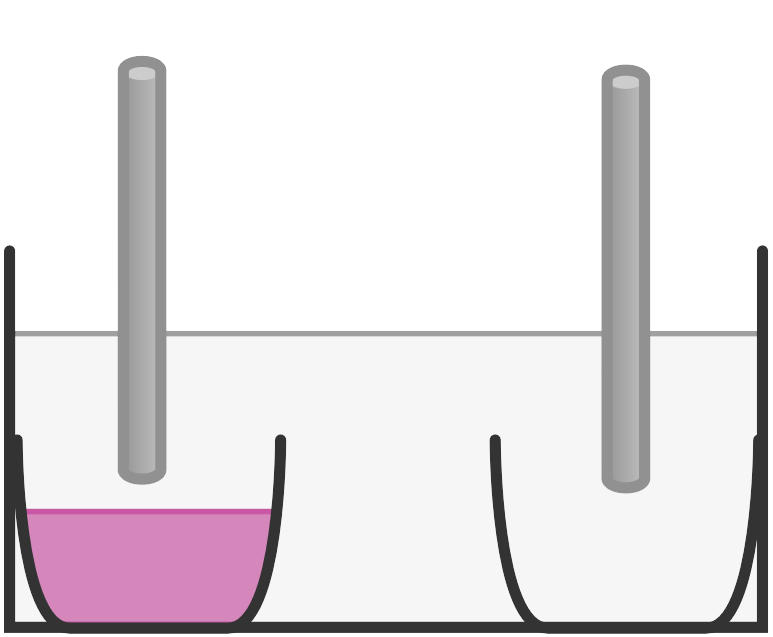
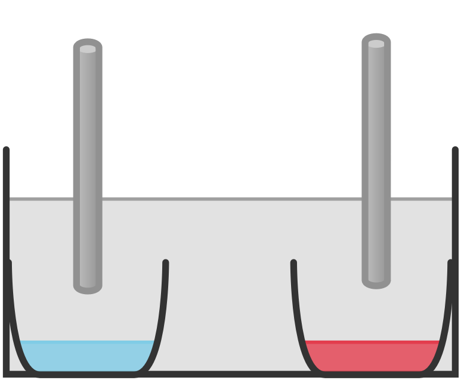
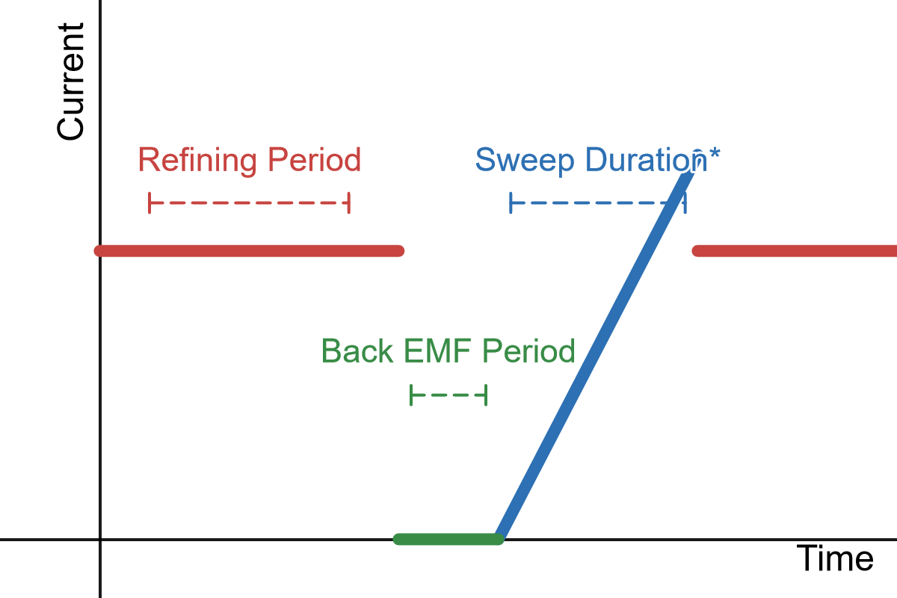
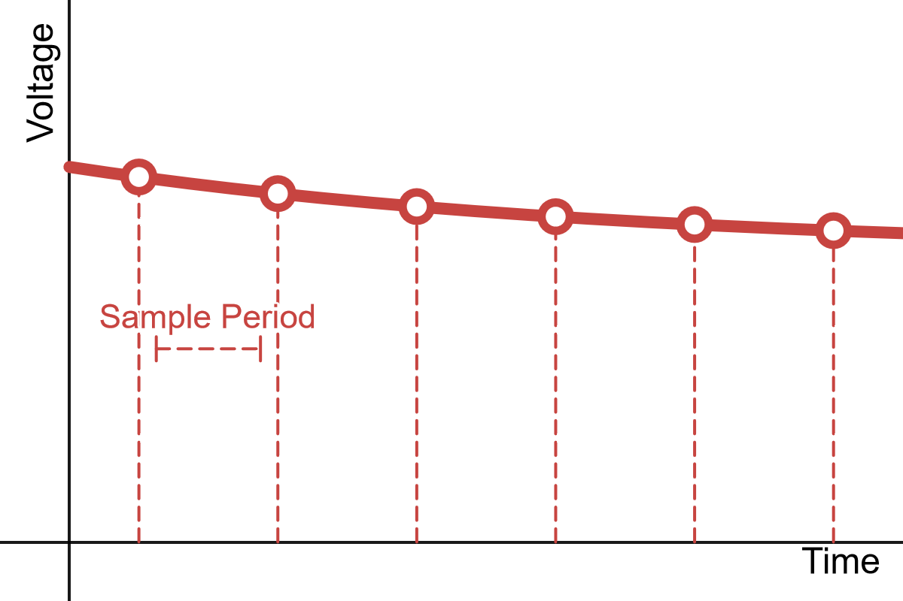
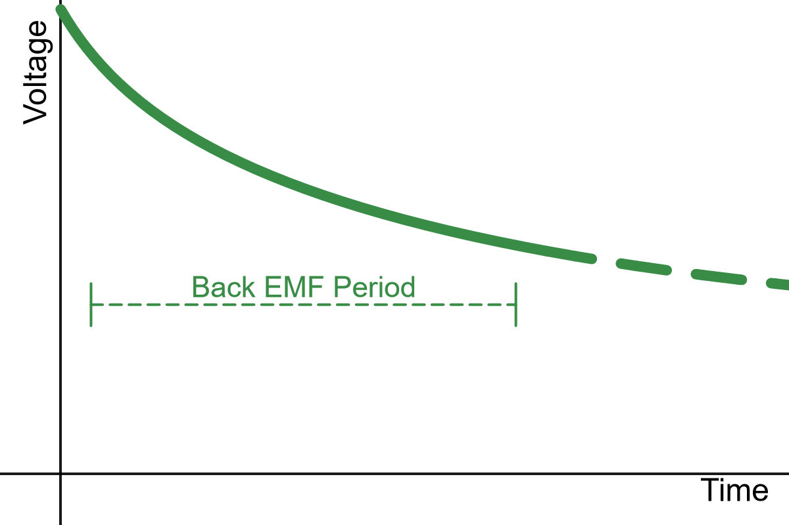
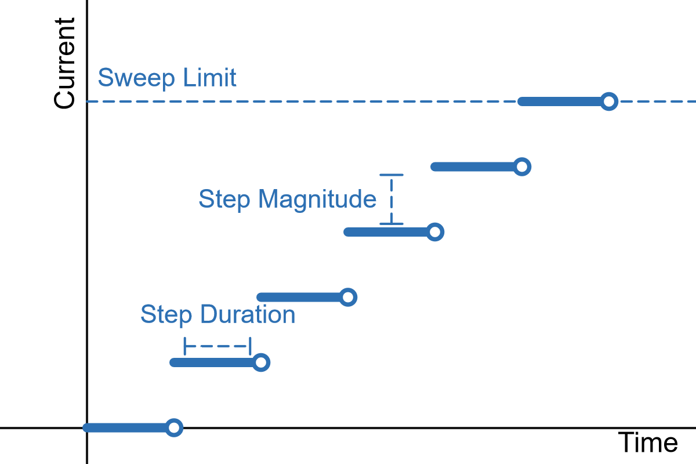
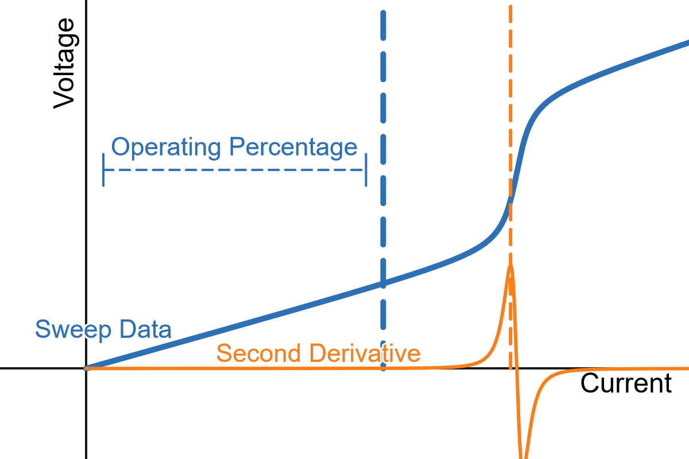
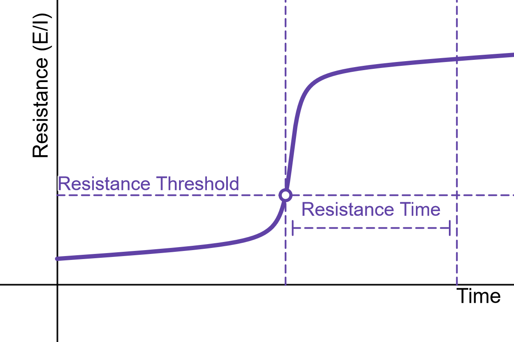

# Autonomous Electrorefining

Developed by Anderson Fuller: [af383@byu.edu](docs/mailto:af383@byu.edu)

## Usage

In the top level directory, there are 4 important files:

* `main.py`: Main script that drives the whole ER process
* `auto_er.py`: This is where all the logic for the refining and sweeps/second derivitivie is
* `prefs.yaml`: Contains all user-specified parameters that the script needs. Can be changed during an ER run as the script pulls data between refining/back emf measuring/sweeping
* `power_supply.py`: Specific to our Keysight programmable DC power supply, can be refactored for other devices/communication protocols

To use this project, clone the repo or download the above files, navigate to the directory containing those files and run: `$ python ./main.py`

## Dependencies

* Python 3.x

Install via `pip` or any package manager of your choice:

* [PyYAML](https://pypi.org/project/PyYAML/)
* [numpy](https://pypi.org/project/numpy/)

## Purpose

The purpose of this project is to maximize the yield of electrorefining in a two-electrode electrochemical cell. This is typically a very straightforward process, but difficulties arise when there are many impurities in the system with similar standard apparent reduction potentials ($E^{0^\prime}$), sometimes referred to as formal potentials. By performing linear sweep amperometry throughout the process, the maximum operating potential can be found and applied. Using an automatic DC power suppy, this entire process, which can take upwards of 36 hours, can be automated to maximize yield while minimizing the need of user intervention.

## Background

Consider the following electrochemical reactions and their standard reduction potentials (note that non-standard notation is used for ease of understanding):

| Reaction                            | $E^{0^\prime} (\text V)$ |
| ----------------------------------- | ------------------------ |
| $M_a^+ + e^-\rightleftharpoons M_a$ | 1.00                     |
| $M_b^+ + e^-\rightleftharpoons M_b$ | 1.30                     |

For the sake of example, we are given a sample with $M_a$ and $M_b$ present (pictured in pink below).

Our goal is to separate the two metals. We do so by putting the sample into a molten salt eutectic system. By using two separate crucibles, we can put an electrode in each one and apply a voltage across the two of them. If the correct voltage is applied, $M_a$ (red) will migrate to the other electrode, leaving $M_b$ (blue) in the original crucible.

Once cooled, the system will then contain a crucible with $M_a$ and one without.

## Difficulties

Now that the basic goal is laid out, a process can be derived. The most difficult part of the process is determining which voltage to apply. Since we are working in a two-electrode setup, we cannot know the true electrochemical potential at either electrode, just their voltage difference.

The voltage we must apply will change as the concentrations of the two metals change. Because the goal of electrorefining is to change this concentration ratio, the voltage needed to advance this reaction will constantly be changing.

## Solution

To overcome this changing equilibrium potential, we perform a linear sweep amperometry scan. Afterwards, we take the numerical second derivitive and find its maximum. Then, we take a specified percentage of that maximum and operate at the resulting current.

This ensures that we find the "deviation point" or when the voltage-current relationship is no longer strictly linear. At this point, $M_a$ will oxidize on the cathode at the fastest rate possible without reducing any $M_b$. To err on the side of caution, we do not operate at this point, but a percentage below it. This is to ensure that we do not oxidze any $M_b$, which nullifies the point of the electrorefining process.

In order to for the run to automatically complete, we observe the caclulated DC resistance by dividing the measured voltage by the measured current. Once the run is completed and $M_a$ is depleted from the original crucible, the calculated resistance shoots upwards quickly and drastically (as much as 30x normal). Once it is above the thresdhold for a long enough amount of time, the run automatically stopss

## Parameters

The main parameters specifed by the user are as follows:

| Parameter                | Unit        | Description                                                                                                                                                                                                                                         |
| ------------------------ | ----------- | --------------------------------------------------------------------------------------------------------------------------------------------------------------------------------------------------------------------------------------------------- |
| **Refining Period**      | Minute      | Time of normal operation between the end of the last back emf measurement/sweep and the start of the next Back emf measurement/sweep                                                                                                                |
| **Back Emf Period**      | Seconds     | Time to measure the decaying open circuit voltage/back emf before starting the sweep                                                                                                                                                                |
| **Sweep Duration\***     | Seconds     | Total duration of the sweep. Must be a multiple of step duration                                                                                                                                                                                    |
| **Sample Period**        | Seconds     | Time between sampling the voltage of the cell during normal operation. During back emf measurement, data is collected continously                                                                                                                   |
| **Step Duration**        | Seconds     | Time to remain at each current step before measuring the resulting voltage. This is to ensure all capacative elements have "leveled off"                                                                                                            |
| **Step Magnitude\***     | Milliamps   | Magnitude between current points in the sweep. The sweep will start at zero and increase until it reaches the specified sweep limit                                                                                                                 |
| **Sweep Limit**          | Amps        | Maximum current that the sweep will reach. This is done as a safety measure more than anything, as collecting data on the higher end can be quite useful                                                                                            |
| **Operating Percentage** | 0.00 - 1.00 | The percentage of the maximum second derivative's current to operate at. For example, if the second derivative has a maximum at 40A and the operating percentage is 50%, the power supply will then operate/refine at 20A                           |
| **Resistance Threshold** | Ohms        | The calculated DC resistance that the cell needs to exceed in order to automaticaly turn off. A good value is 10x your initial calculated resistance                                                                                                |
| **Resistance Time**      | Seconds     | The "debounce" period for the auto shut-off process. The calculated resistance needs to exceed the threshold for this amount of time before shutting down. If it drops below the threshold, the timer resets -- similar to a debounce state machine |

The asterisked parameters are optional; you only need to specify one. Both are implemented as a quality of life feature. If both are provided, the calibration duration parameter will be ignored:

| Operation Modes | Step Magnitude* | Step Duration | Sweep Limit | Sweep Duration* |
| :-------------: | :-------------: | :-----------: | :---------: | :-------------: |
|      **A**      |        X        |       X       |      X      |    Automatic    |
|      **B**      |    Automatic    |       X       |      X      |        X        |
|      **C**      |        X        |       X       |      X      |   X, ignored    |

## Future Work

* [ ] Implement sweep duration parameter (currently only using step duration)
* [ ] Rudimentary calculations during run (total charge passed, estimated completion percentage)
* [ ] Re-evaluate step duration (maybe take reading when voltage stops changing beyond a certain amount)
* [ ] GUI (see the `flet` branch)
  * At-a-glance run progress (time elapsed, charge passed, estimated completion percentage)
  * User intervention handling (stop button)
  * Change parameters on the fly
  * Easily view graphs of past sweeps/back emf measurements

<!--

diagrams:

        https://www.desmos.com/calculator/cnfgl0nqbr
        https://www.desmos.com/calculator/vav48ojkwn
        https://www.desmos.com/calculator/msjydh5wgm
        https://www.desmos.com/calculator/krfqa2l97h
        https://www.desmos.com/calculator/uzhmusnkfg
        https://www.desmos.com/calculator/s6i6tq6nnx

-->